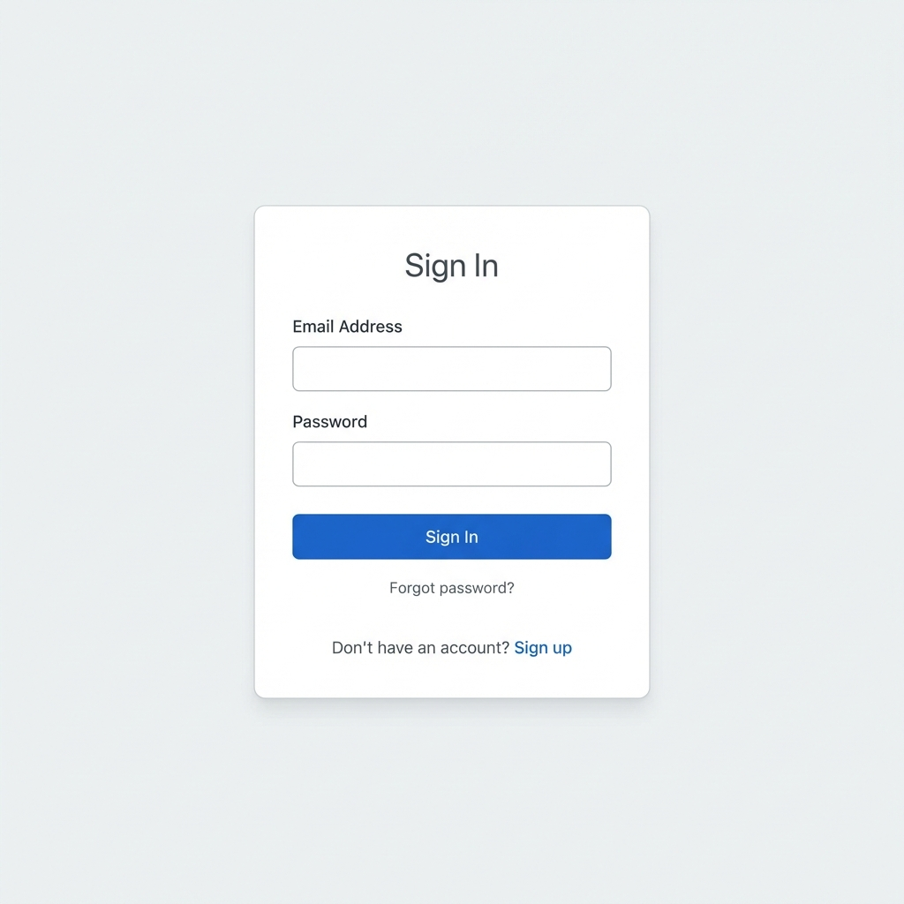
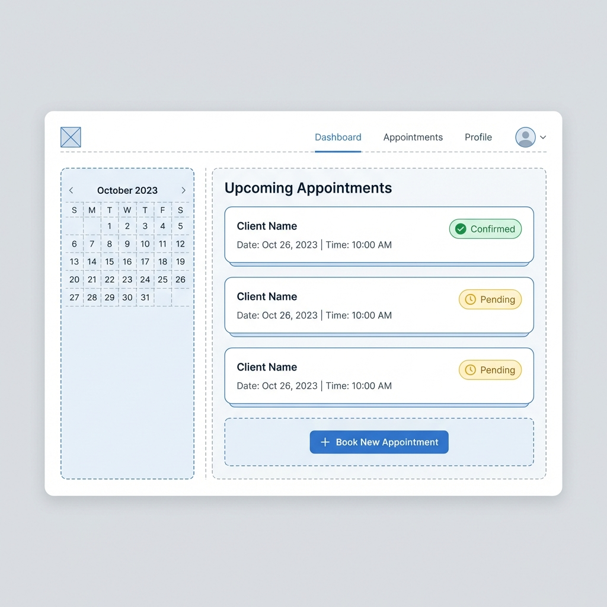
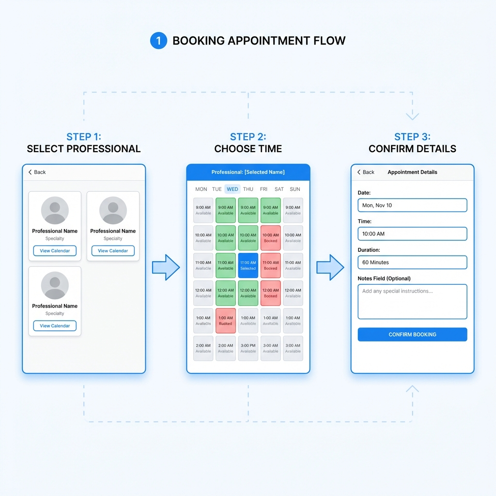
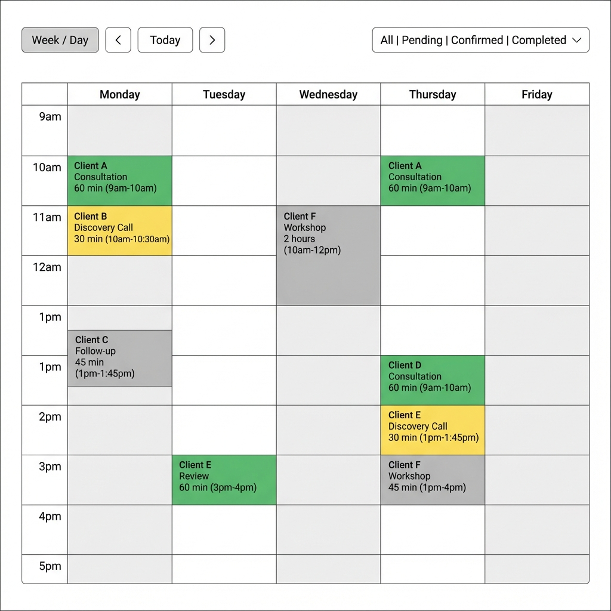

# Wireframes - MVP #2: Plataforma de Agendamiento

Visual mockups de los flujos principales de usuario.

---

## 1. Login / Authentication

**Flow**:
1. User lands on login page
2. Enters email + password
3. Clicks "Sign In"
4. Redirects to `/dashboard` if successful
5. Shows error message if invalid credentials

**Key Elements**:
- Centered card layout
- Email input (with validation)
- Password input (masked)
- "Forgot password?" link
- "Sign up" link for new users

---

## 2. Dashboard (Client View)

**Components**:
- **Top Navigation**: Logo, menu items (Dashboard, Appointments, Profile), user avatar
- **Left Sidebar**: Mini calendar (month view)
- **Main Content**:
  - "Upcoming Appointments" list
  - Each appointment card shows: client/professional name, date, time, status badge
  - "Book New Appointment" CTA button

**Status Colors**:
- 🟢 Green: Confirmed
- 🟡 Yellow: Pending
- ⚫ Gray: Completed
- 🔴 Red: Cancelled

---

## 3. Booking Flow (3 Steps)

### Step 1: Select Professional
- Grid of professional cards
- Each card: photo, name, specialty, "View Calendar" button
- Search/filter by specialty (dropdown)

### Step 2: Choose Time
- Weekly calendar view
- Color-coded slots:
  - 🟢 Green: Available
  - 🔴 Red: Booked
  - 🔵 Blue: Selected
- Shows professional's availability hours
- Past dates grayed out/disabled

### Step 3: Confirm Details  
- Readonly fields: Date, Time, Duration
- Editable field: Notes (optional, max 500 chars)
- "Confirm Booking" button
- "Back" to return to previous step

**Post-Booking**:
- Success message
- Redirect to `/dashboard/appointments`
- Confirmation email sent

---

## 4. Calendar View (Professional)

**Features**:
- **Top Toolbar**:
  - Week navigator (< Today >)
  - View switcher (Week/Day)
  - Filter dropdown (All | Pending | Confirmed | Completed)
- **Calendar Grid**:
  - Monday-Friday columns
  - 9am-5pm rows (configurable)
  - Hourly slots
- **Appointment Blocks**:
  - Color-coded by status
  - Shows: client name, appointment type, duration
  - Clickable to view details

**Interactions**:
- Click appointment → modal with details + actions (Confirm, Reject, Complete)
- Click empty slot → "Block time" or "Add note"
- Drag to reschedule (V2 feature)

---

## Notes for Implementation

### Responsive Behavior
- **Mobile**: Stack sidebar below content, switch to day view by default
- **Tablet**: Sidebar collapses to hamburger menu
- **Desktop**: Full layout as shown

### Accessibility
- All interactive elements keyboard-accessible
- Color coding supplemented with text labels (not color-only)
- Focus indicators on all inputs
- Screen reader labels for icon-only buttons

### Design System References
- Colors: See `DESIGN_SYSTEM.md` → Primary/Secondary palette
- Typography: Inter (UI), Outfit (headings)
- Spacing: 4px grid system
- Components: Use shadcn/ui base components

---

**Last Updated**: 2026-01-13  
**Tool**: AI-generated wireframes  
**Next Steps**: Convert to high-fidelity mockups in Figma (optional)
